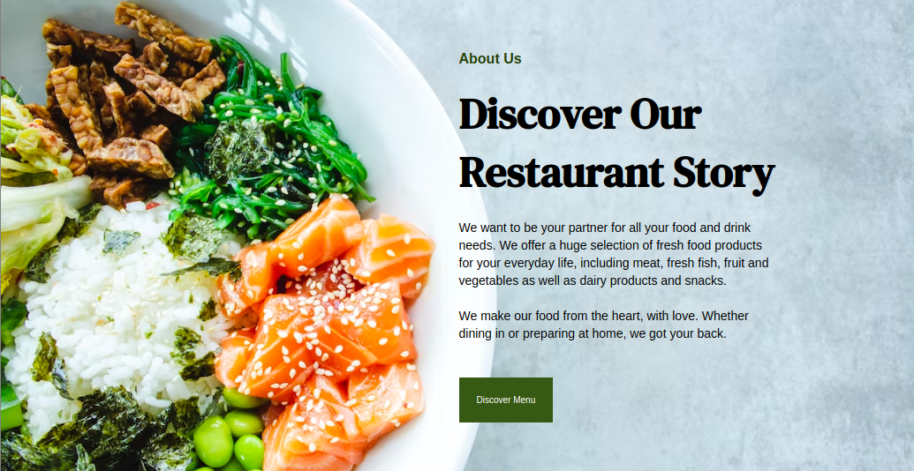

# bistro-primero
Business website created for Bistro Primero.

[View Live Site](https://alabador.github.io/bistro-primero/)

## How It's Made

Tech Used: HTML, Vanilla CSS

## Lessons Learned

Making sure all screen sizes are accounted for, and adjusting for responsiveness. For this project, I was only given desktop designs, and had to scale down. If starting from the beginning, I would like to implement a mobile-first approach.